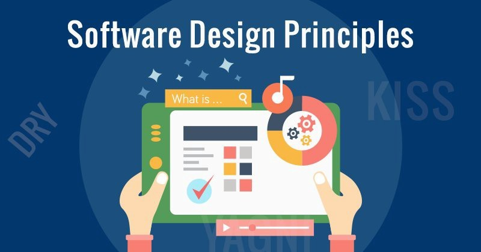

# DesignPrinciples

Design principles are fundamental guidelines that help software developers create robust, maintainable, and flexible systems. They focus on structuring code to minimize dependencies, enhance readability, and ensure that components are reusable and adaptable to change. 

---
Following are various design principles, each representing a distinct approach to crafting effective and maintainable software
1. [SOLID](./SOLID.md)
2. DRY (Don't Repeat Yourself)
3. KISS (Keep It Simple, Stupid)
4. YAGNI (You Aren't Gonna Need It)
5. Separation of Concerns
6. Encapsulation
7. Composition over Inheritance

---
While these principles are often complementary, they can sometimes be contradictory; developers must carefully evaluate the specific needs, constraints, and goals of their projects to determine when and how to apply each principle effectively.  

1. **Single Responsibility Principle (SRP) vs. Composition over Inheritance**

  >SRP advocates for classes to have only one reason to change, focusing on a single responsibility.

  >Composition over Inheritance promotes using composition to achieve functionality rather than inheritance. While these principles are generally complementary, excessive adherence to SRP might lead to a proliferation of small classes that could be more effectively managed through composition, potentially leading to a complex structure.

2. **Open/Closed Principle (OCP) vs. DRY (Don't Repeat Yourself)**

>OCP suggests that code should be open for extension but closed for modification, encouraging the addition of new features without altering existing code.

>DRY emphasizes avoiding code duplication by abstracting common functionality into reusable components. In practice, applying OCP might sometimes lead to creating new abstractions or classes that could introduce some level of duplication or complexity, which needs to be balanced against the goal of avoiding repetition.

3. **Interface Segregation Principle (ISP) vs. DRY (Don't Repeat Yourself)**

>ISP advocates for multiple, specific interfaces rather than a single, general-purpose interface, which can lead to more focused and manageable interfaces.

>DRY encourages reducing redundancy by reusing code. Applying ISP may lead to creating more interfaces, which could seem contrary to the goal of minimizing code duplication, though it ultimately improves modularity and reduces unnecessary dependencies.

4. **Encapsulation vs. Open/Closed Principle (OCP)**

>Encapsulation focuses on hiding internal details and exposing only necessary functionality, which might suggest a more rigid structure.

>OCP encourages extending functionality without modifying existing code, which can sometimes involve exposing additional interfaces or altering existing encapsulation boundaries. Balancing encapsulation with the need for extensibility is crucial to maintaining both flexibility and code integrity.

**Balancing these principles requires thoughtful consideration of the specific context, goals, and constraints of a project. The key is to apply these principles in a way that best fits the needs of the system being developed.** 

---
